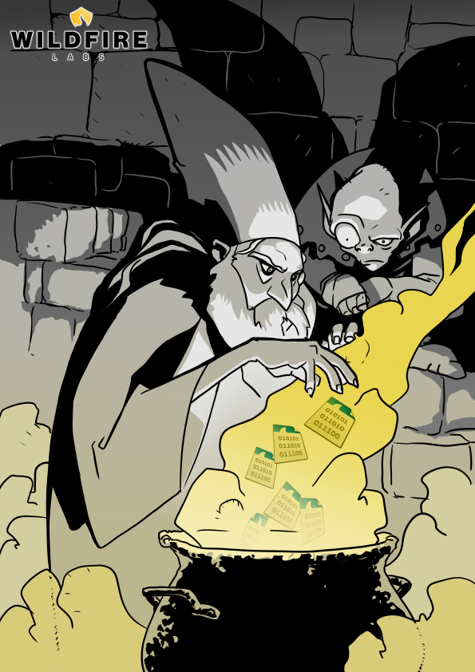

## pcrappyfuzzer

pcrappyfuzzer.py: a very simple mash-up of Scapy + [radamsa](https://github.com/aoh/radamsa) to extract data from a PCAP file and perform quick 'n dirty fuzzing ad infinitum.

Originally written for a penetration testing engagement, but modified to support the blog post "Fuzzing proprietary protocols with Scapy,
radamsa and a handful of PCAPs" published in [https://blog.blazeinfosec.com](https://blog.blazeinfosec.com)

## Author

* **Julio Cesar Fort** - julio at blazeinfosec dot com

## Contributors

* **Veerendra** - [@veerendra2](https://github.com/veerendra2)

## License 

This project is licensed under the Apache License - see the [LICENSE](LICENSE) file for details

Copyright 2016-2017, Blaze Information Security
https://www.blazeinfosec.com

## Kudos

Thanks to the talented folks of [Hackerstrip](https://hackerstrip.exposure.co/) for the art used in our blog post.

